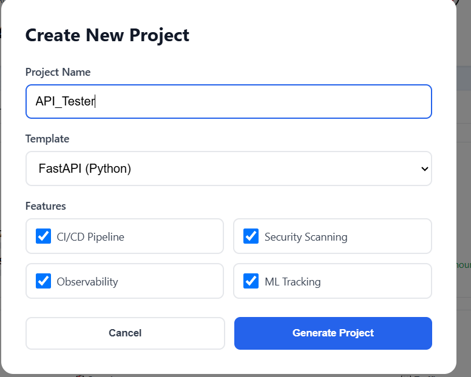
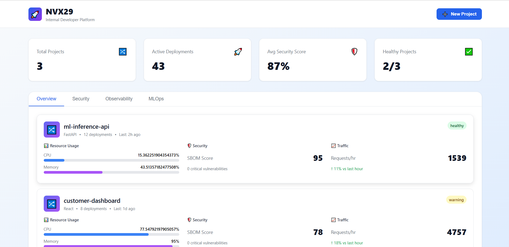
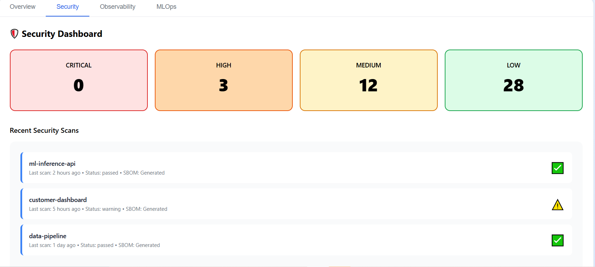
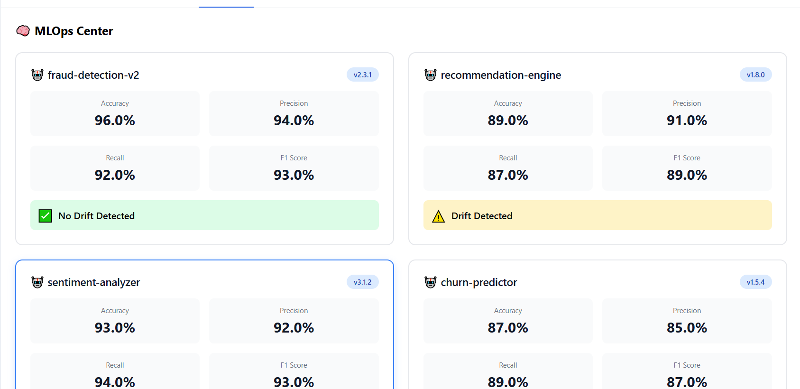
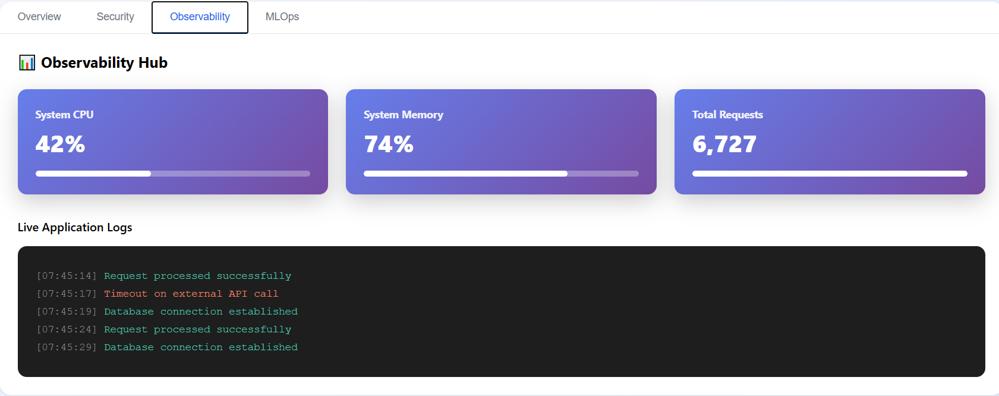

# 🚀 NVX29 — The Next-Gen Internal Developer Platform (IDP)

### 🧠 Built by: **Naga Venkata Neeraj**  
📞 **+91 6309321875**  
🔗 [LinkedIn Profile](https://www.linkedin.com/in/nvn18)  

---

## 🧩 Problem Statement

In large enterprises like **TCS, HSBC, and NVIDIA**, thousands of developers work across multiple projects.  
Every new project repeats the same painful, time-consuming setup steps:

- Creating and configuring repositories  
- Setting up CI/CD pipelines  
- Managing infrastructure and security  
- Integrating observability and monitoring tools  
- Managing ML models and ensuring compliance  

These repetitive tasks lead to **slower onboarding, configuration drift, and security gaps**.

---

## 💡 NVX29 — The Solution

**NVX29** automates the entire developer onboarding, setup, and deployment lifecycle.  
It unifies **DevOps + MLOps + Security** into a single automated control center.

Imagine:  
> You select your tech stack → NVX29 generates your repo with CI/CD, Dockerfile, monitoring, and security ready out of the box.  

You deploy confidently with **one click** — with built-in **GitOps**, **SBOM**, and **ML model tracking**.

---

## 🏗️ Workflow Architecture

```
┌───────────────────────────────────────────────────────────────────────────┐
│                             NVX29 PLATFORM                               │
├───────────────────────────────────────────────────────────────────────────┤
│ 1️⃣ Project Generator → Creates ready-to-deploy repos                    │
│ 2️⃣ GitOps Engine → Deploys via ArgoCD / GitHub Actions                 │
│ 3️⃣ SBOM + Security → Syft, Trivy, Sigstore integrated                  │
│ 4️⃣ Observability → OpenTelemetry + Prometheus + Grafana                 │
│ 5️⃣ MLOps Manager → MLflow + EvidentlyAI for drift detection             │
│ 6️⃣ Developer Portal UI → React dashboard to control all operations      │
└───────────────────────────────────────────────────────────────────────────┘
```

Each module works in sync through APIs and GitOps workflows.  
The backend (FastAPI/Node) interacts with PostgreSQL and manages the project metadata and logs.  

---

## ⚙️ Code Structure

```
NVX29/
├── backend/
│   ├── app/
│   │   ├── api/
│   │   ├── core/
│   │   ├── models/
│   │   ├── services/
│   │   └── main.py
│   ├── Dockerfile
│   └── requirements.txt
│
├── frontend/
│   ├── src/
│   │   ├── components/
│   │   ├── pages/
│   │   ├── services/
│   │   └── App.jsx
│   ├── public/
│   └── package.json
│
├── ci_cd/
│   ├── github-actions/
│   └── argocd/
│
├── security/
│   ├── syft_scan.yaml
│   ├── trivy_report.json
│   └── sign_builds.sh
│
├── mlops/
│   ├── mlflow_tracking/
│   └── drift_detection/
│
├── docs/
│   ├── architecture.png
│   ├── workflow.png
│   └── usage-guide.md
│
└── README.md
```

---

## 💻 Tech Stack

| Layer | Technologies |
|-------|---------------|
| **Frontend** | React + TailwindCSS |
| **Backend** | FastAPI (Python) / Node.js (Express) |
| **CI/CD** | GitHub Actions, ArgoCD |
| **Infrastructure** | Docker, Kubernetes (Minikube for demo) |
| **Security** | Syft, Trivy, Sigstore (Cosign) |
| **Observability** | OpenTelemetry, Prometheus, Grafana |
| **MLOps** | MLflow, EvidentlyAI |
| **Database** | PostgreSQL |
| **Auth** | JWT + GitHub OAuth |

---

## ⚖️ Why NVX29 is Better Than Jenkins, GitLab CI, etc.

| Feature | Jenkins / GitLab | NVX29 Advantage |
|----------|------------------|-----------------|
| **Setup Time** | Manual job setup | Auto project generation |
| **Security** | Add-ons needed | Built-in SBOM & signing |
| **MLOps Support** | None / minimal | Full MLflow integration |
| **Observability** | External plugins | Native OpenTelemetry |
| **UI/UX** | Old-school dashboards | Modern, React-based portal |
| **Unified Control** | Separate tools | One-stop platform |
| **Open Source** | Yes | Yes + modular architecture |

---

## 🧩 Example Use Case

**Scenario:**  
A team in NVIDIA wants to start a FastAPI + React project for model deployment.  

**Using NVX29:**
1. Login via GitHub OAuth  
2. Select “FastAPI + React” template  
3. Click **“Generate Project”** → Repo created with:
   - Dockerfile  
   - Pre-built CI/CD pipeline  
   - Trivy scan + SBOM  
   - Grafana dashboard  
4. Click **“Deploy”** → Deployed to Minikube via ArgoCD  
5. Open dashboard → View logs, metrics, and model drift stats  

⏱️ Total time: *5 minutes instead of 3 days.*

---

## 📸 Screenshots (to be added)

Place your images in the `images` folder:

```
Images/
├── creation.png
├── dashboard.png
├── security.png
├── Mlops.png
└── observability.png
```

In README:


*Creation of the API to keep track and process the flow*


*NVX29 Developer Dashboard - Project overview and quick actions*


*Integrated security scanning with Trivy and SBOM generation*


*MLflow tracking and model drift detection with EvidentlyAI*


*Real-time metrics and logs with Prometheus and Grafana*


---

## 🧠 Future Enhancements

- Cloud cost estimator  
- AI-based pipeline optimizer  
- Role-based access control (RBAC)  
- Plugin marketplace for third-party integrations  
- Slack/GitHub bot for deployment notifications  

---

## 🔧 How to Run (MVP Setup)

```bash
# Clone repo
git clone https://github.com/nvn18/NVX29.git
cd NVX29

# Backend setup
cd backend
pip install -r requirements.txt
uvicorn app.main:app --reload

# Frontend setup
cd ../frontend
npm install
npm run dev
```


---

## 🤝 Open Source Contributions

We’re still building **NVX29** — it will soon be **launched publicly** and opened for **community contributions**.  

Stay tuned and follow for updates 🌟  

---

## 👨‍💻 Author

**Naga Venkata Neeraj**  
📞 +91 6309321875  
🔗 [LinkedIn](https://www.linkedin.com/in/nvn18)  
📧 neerajvanimireddy@gmail.com  

---

⭐ **If you like NVX29, give this repo a star and join the upcoming open-source revolution in developer experience!**
